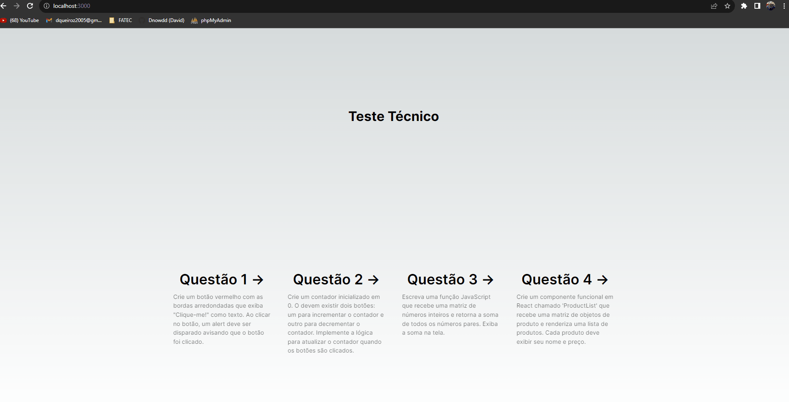
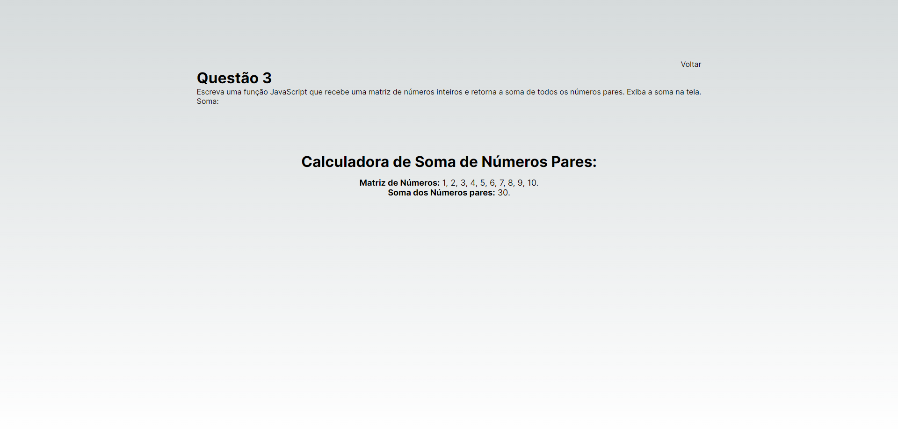

# Resultados do Teste Técnico em Desenvolvimento Web - React

Este documento contém os resultados das quatro (4) questões técnicas sobre React propostas no repositório https://github.com/paulotolentino/teste-tecnico-estagiario.

## Questão 1:
Crie um botão vermelho com as bordas arredondadas que exiba "Clique-me!"
como texto. Ao clicar no botão, um alerta deve ser disparado avisando que
o botão foi clicado.

#### Imagem

  
  

## Questão 2:
Crie um contador inicializado em 0. A tela deve exibir dois botões: um
para incrementar o contador e outro para decrementar o contador. Ao
carregar a tela, o contador deve ser atualizado para 10. Implemente a
lógica para atualizar o contador quando a tela for carregada e a lógica
para atualizar o contador quando os botões forem clicados.

#### Imagem

  
  

## Questão 3:
Escreva uma função JavaScript que recebe uma matriz de números inteiros
e retorna a soma de todos os números pares. Exiba a soma na tela.

#### Imagem

  
  

## Questão 4:
Crie um componente chamado `ProductList` que recebe uma matriz de
objetos de produto e renderiza uma lista de produtos. Cada produto deve
exibir seu nome e preço.

#### Imagem

